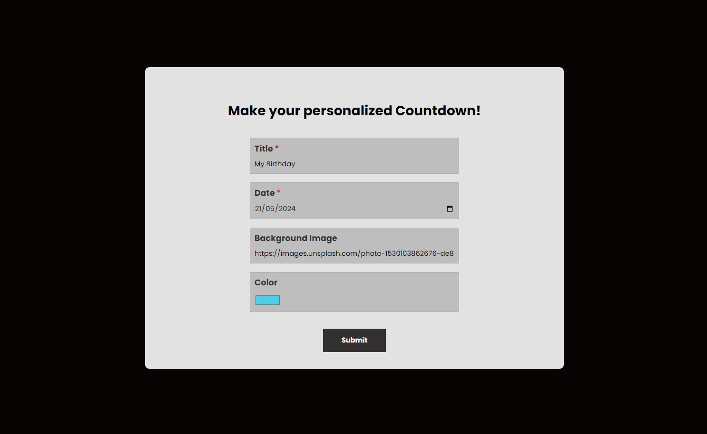
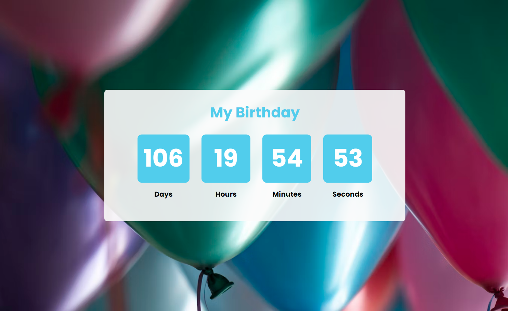

# Countdown Timer

This project is a simple countdown timer implemented using React. It allows users to set a specific date and then counts down to zero. The user can also customize the event's name, a background image and a prefered color to the counter. The timer displays the remaining hours, minutes, and seconds in real-time.

The application uses React Router to configure routes, as well as using a custom [`useCountdown`](https://github.com/mat-afk/countdown-timer/blob/main/src/hooks/useCountdown.jsx) hook to abstract the time update logic and a [`CountdownContext`](https://github.com/mat-afk/countdown-timer/blob/main/src/context/CountdownContext.jsx) to access user customizations at various levels of the application.


## Getting Started

### Prerequisites

Make sure you have Node.js and npm installed on your machine.

### Installation

1. Clone this repository

   ```sh
   git clone https://github.com/mat-afk/countdown-timer.git
   ```

2. Navigate to the project directory

   ```sh
   cd countdown-timer
   ```

3. Install dependencies

   ```sh
   npm i react-router-dom
   ```

4. Run the app

   ```sh
   npm run dev
   ```

### Usage

1. Open your browser and visit `http://localhost:5173/` to view the app.

2. Set the date, event name, background image's URL, and color of the counter.
   

3. The timer will start counting down to the specified date.
   
